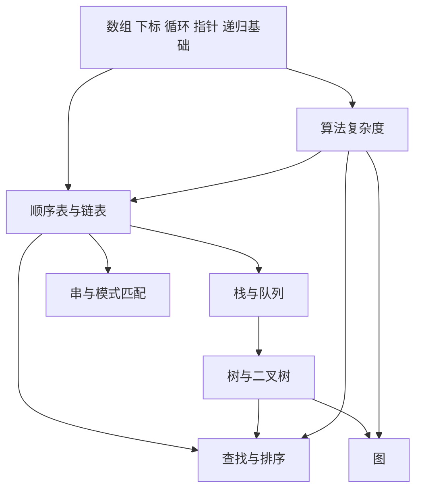

# 数据结构核心知识地图

以[2026数据结构教材](../books/2026数据结构_带书签.pdf)的8章为范围。下表的“会做什么”是待验证能力，不是当前掌握情况。正文书页 = PDF页 − 12；知识小节的准确PDF页见[教材目录](教材目录.md)，题目入口见[真题索引](真题索引.md)。

## 先修关系

图表示学习依赖，不表示每个前置模块都要全部精通才能继续。语法随具体算法补，避免先花很长时间完整重学一门编程语言。

## 第1章 绪论

教材书页1～11，PDF13～23；真题重点入口为1.2。

| 核心点 | 必须理解与会做 | 条件与常见混淆 |
|---|---|---|
| 数据结构三要素 | 区分逻辑结构、存储结构、数据运算；说明同一逻辑结构为何可有不同实现 | 顺序表不是“所有线性表”；逻辑相邻不必物理相邻 |
| 算法的要求 | 区分算法性质、正确性、可读性、健壮性和效率 | 程序能运行不等于覆盖所有合法输入 |
| 时间复杂度 | 从执行次数建立数量级；分析顺序、嵌套、倍增循环和简单递归 | 嵌套循环不必都是平方；内层次数若依赖外层要先求和 |
| 空间复杂度 | 区分输入空间与辅助空间；计入递归调用栈 | 原地处理不等于一定零辅助空间；递归深度与调用总次数不同 |
| 最好、平均、最坏 | 说明所分析输入和概率假设 | 不能把最好情况当作算法的一般保证 |

起步验证：手工追踪一段循环，说明基本操作执行次数如何随n变化；不只选出一个大O符号。

## 第2章 线性表

教材书页12～61，PDF24～73；真题入口2.2、2.3。

| 核心点 | 必须理解与会做 | 条件与常见混淆 |
|---|---|---|
| 抽象线性表 | 解释元素、位序、前驱后继及基本运算 | 位序常从1起，数组下标常从0起，先统一 |
| 顺序表 | 按下标访问、按值查找、插入删除与移动次数 | 随机存取是按位置直接访问，不是任意按值查找都O(1) |
| 数组算法 | 删除筛选、去重、区间交换、逆置、双指针扫描 | 原数组能否修改、是否有序、额外空间限制先读题 |
| 单链表 | 画头指针、头结点、首元结点；完成插入、删除、遍历 | 已知前驱时局部修改可O(1)，查找前驱通常另花O(n) |
| 双链表、循环链表 | 正确维护前后指针及循环终止条件 | 空表、单结点、删除首尾；循环链表不能照抄NULL终止条件 |
| 链表算法 | 逆置、合并、快慢指针、查找公共部分等 | 修改链接前保存仍需使用的后继，避免断链、漏结点或成环 |
| 存储结构选择 | 根据访问、插删和空间需求比较顺序表与链表 | “链表插删一定更快”忽略了定位成本与具体操作 |

算法题输出：一句思路 → 结点/下标追踪 → 关键代码或伪代码 → 边界 → 时间与辅助空间。先完成一个可靠方案，再按题目约束改进。

## 第3章 栈 队列和数组

教材书页62～108，PDF74～120；真题入口3.1～3.4。

| 核心点 | 必须理解与会做 | 条件与常见混淆 |
|---|---|---|
| 栈的操作与序列 | 根据入栈序列模拟合法出栈过程；理解顺序栈、链栈和共享栈 | 检查容量限制、栈顶初值、先移动还是先读写 |
| 循环队列 | 画front/rear的含义，推导判空判满及元素个数 | 若rear指下一入队位置且牺牲一格：空front=rear，满(rear+1)%m=front；其他实现另推 |
| 链式队列与双端队列 | 正确处理入队、出队、最后一个结点；模拟两端受限操作 | 删除最后一个结点时尾指针是否需重置 |
| 表达式 | 中缀转后缀、运算符栈、后缀求值 | 非交换运算必须先弹右操作数再弹左操作数；注意括号与结合性 |
| 递归与栈 | 展开一次递归调用、返回结果和保存的状态 | 递归辅助空间按最大同时在栈上的调用深度分析 |
| 数组地址 | 行优先、列优先的地址计算 | 行列下界、维度、每元素字节数和基地址都要写清 |
| 特殊与稀疏矩阵 | 推导对称、三角、三对角矩阵的压缩位置；理解三元组 | 常量区是否占一格、下标从0或1起影响公式；稀疏矩阵不直接套三角公式 |

验证：先画状态再更新指针；矩阵地址先数目标前有几个已存元素，再乘元素大小，避免背错下标公式。

## 第4章 串

教材书页109～123，PDF121～135；真题入口4.2。

| 核心点 | 必须理解与会做 | 条件与常见混淆 |
|---|---|---|
| 串与朴素匹配 | 区分主串、模式串、子串、空串；追踪失配后的移动 | 空串与仅含空格的串不同；返回位置的起点要明确 |
| KMP的思想 | 解释已匹配前后缀如何避免主串指针回退 | 回退的是模式串位置；不要仅机械记next数组 |
| next与nextval | 按教材或题目约定求表、模拟失配转移 | 0起始/1起始、-1/0哨兵等定义不同，数组值不能混用 |
| 匹配效率 | 分开分析预处理模式串和扫描主串的成本 | 常规KMP总时间O(n+m)，需说明n、m分别是什么 |

验证：对一个模式串说明一次失配为何跳到该位置；能算表，也能用表完成匹配。

## 第5章 树与二叉树

教材书页124～197，PDF136～209；真题入口5.1～5.5。

| 核心点 | 必须理解与会做 | 条件与常见混淆 |
|---|---|---|
| 树的术语与性质 | 度、叶子、祖先、深度、高度；用边数联系结点度数 | 根的层数和树高是否从1起，空树如何定义要先统一 |
| 二叉树与完全二叉树 | 区分满、完全及一般二叉树；由层数、编号推结点关系 | 非空二叉树有n₀=n₂+1；完全二叉树编号公式依赖下标起点 |
| 存储结构 | 顺序存储与二叉链表；理解空指针数量 | 顺序存储适合性与树形有关，不能混淆结点编号与关键字 |
| 四种遍历 | 先序、中序、后序、层序；递归与栈/队列实现 | 层序用队列；访问时机决定前三种遍历差异 |
| 由遍历重建 | 在结点标识互异等条件下，用中序配先序或后序重建 | 仅先序和后序通常不能唯一确定一般二叉树 |
| 二叉树算法 | 结点计数、求高、交换子树、路径与祖先类问题 | 先定义函数返回什么，再写空树出口与合并规则 |
| 线索二叉树 | 区分孩子指针与前驱/后继线索，按tag判断 | 线索的含义取决于遍历次序，不能将中序规则套到后序 |
| 树 森林与二叉树 | 孩子兄弟表示、转换及遍历对应 | 左孩子右兄弟描述关系，不等于原树的左右孩子 |
| 哈夫曼树与编码 | 按权值合并，计算WPL，构造前缀编码 | 等权可能有不同最优树/编码；最优不意味着唯一 |
| 并查集 | 集合代表、find/union，理解路径压缩与按秩/大小合并 | 代表元素不必是最小编号；两种优化不是同一个动作 |

验证：从图到遍历、从遍历到图，再写一个需要返回信息的递归算法；只会背遍历序列不算会树算法。

## 第6章 图

教材书页198～268，PDF210～280；真题入口6.1～6.4。

| 核心点 | 必须理解与会做 | 条件与常见混淆 |
|---|---|---|
| 图的概念 | 有向/无向、度、路径、连通、强连通、生成树 | 简单图与允许自环/重边的图不能共用所有计数结论 |
| 图的存储 | 邻接矩阵、邻接表，理解十字链表与邻接多重表用途 | 无向图邻接表每条边通常存两次；矩阵无边标记与0权边要区分 |
| BFS与DFS | 按指定访问顺序模拟，处理非连通图，生成遍历树/森林 | 邻接表常规实现O(V+E)，邻接矩阵通常O(V²)；序列取决于邻接点顺序 |
| 最小生成树 | 模拟Prim、Kruskal，用割/环的思想解释选择 | 标准对象是连通无向带权图；不连通时考虑生成森林；不等于最短路径树 |
| 单源最短路径 | 模拟Dijkstra的确定集合与松弛过程 | 常规Dijkstra要求边权非负；无权图的最少边数路径可用BFS |
| 所有顶点对最短路 | 理解Floyd逐步允许中间顶点，更新距离 | 可处理负边；负环会使相关最短路不存在有限最小值 |
| DAG与拓扑排序 | 用入度/栈或队列生成序列，判环，理解表达式共享子式 | 拓扑序可能不唯一；有向有环图无拓扑序 |
| 关键路径 | 区分事件与活动，计算最早/最迟时间及余量 | 用AOE网的DAG约定；多个关键路径时缩短一条上的活动未必缩短总工期 |

验证：每步写清候选集合与更新理由；只画出最后一棵树或一条路径不足以定位错误。

## 第7章 查找

教材书页269～336，PDF281～348；真题入口7.2～7.5。

| 核心点 | 必须理解与会做 | 条件与常见混淆 |
|---|---|---|
| ASL | 按概率加权计算成功/失败查找长度 | 明确比较次数口径与样本空间；失败不能默认按成功关键字数平均 |
| 顺序 折半 分块查找 | 构造查找过程与判定树；比较适用存储条件 | 标准折半查找依赖有序且能高效随机访问；mid取整及区间开闭影响过程 |
| 二叉排序树BST | 查找、插入、删除，理解中序有序 | 形状依赖插入顺序，退化时查找可达O(n)；重复关键字规则另定 |
| 平衡二叉树AVL | 按教材平衡因子约定判断失衡与旋转 | LL/LR/RR/RL指失衡路径类型，旋转后保持中序次序 |
| 红黑树 | 颜色约束、黑高与基本调整，和AVL比较 | NIL叶结点与普通数据结点区分；颜色、黑高不能凭图形高度猜 |
| B树与B+树 | 按阶数判断关键字/分支数量，模拟插入分裂及查找 | 根有例外；B+树阶的记法存在教材差异，使用本书或题干定义 |
| 散列表 | 散列函数、装填因子、开放定址与拉链法，计算ASL | 冲突不等于关键字相同；删除不能破坏探查链；失败查找的结束位置要说清 |

验证：按输入序列构造结构并追踪一次成功与失败查找，解释比较次数和边界。

## 第8章 排序

教材书页337～399，PDF349～411；真题入口8.2～8.7，8.1为概念基础。

| 核心点 | 必须理解与会做 | 条件与常见混淆 |
|---|---|---|
| 稳定性与内外排序 | 给相等关键字加身份标记判断先后是否保留 | 稳定性不是“每次运行结果相同”；内部排序与外部排序按主要数据所在存储区区分 |
| 插入与希尔 | 追踪一趟直接插入、折半插入与分组插入 | 折半插入减少比较，不自动减少移动；希尔性能依赖增量序列 |
| 冒泡与快速 | 模拟交换、一次划分及递归区间 | 快排一次划分不是全局有序；枢轴与划分实现影响中间序列 |
| 选择与堆 | 区分简单选择与堆调整；建堆、删除堆顶 | 堆只保证父子偏序；自底向上建堆O(n)，不是O(n log n) |
| 归并 基数 计数 | 归并有序段；按位分配收集；按键域计数 | 基数法每趟的稳定性、位序与基数要明确；计数法成本依赖键域大小k |
| 比较与选择 | 根据规模、初始有序性、稳定性、空间限制选算法 | 比较排序的下界条件不直接约束非比较排序 |
| 外部排序 | 初始归并段、归并路数、败者树、置换选择、最佳归并树 | 分开计算内存工作区、归并趟数和I/O成本；多路最佳归并必要时补零权虚段 |

下表采用常规教材实现，额外空间不含输入数据，n为元素个数。

| 算法 | 最好 / 平均 / 最坏时间 | 辅助空间 | 稳定性 |
|---|---|---|---|
| 直接插入 | O(n) / O(n²) / O(n²) | O(1) | 稳定（相等时不越过原元素） |
| 冒泡（有提前结束） | O(n) / O(n²) / O(n²) | O(1) | 稳定（只交换严格逆序） |
| 简单选择 | O(n²) / O(n²) / O(n²) | O(1) | 通常不稳定 |
| 快速 | O(n log n) / O(n log n) / O(n²) | 递归栈平均O(log n)，最坏O(n) | 通常不稳定 |
| 堆 | 建堆O(n)，完整排序O(n log n)上界 | O(1) | 不稳定 |
| 二路归并（数组常规实现） | O(n log n) / O(n log n) / O(n log n) | O(n) | 稳定（相等时先取左段） |
| 希尔 | 依增量序列，不用统一平均复杂度替代 | O(1) | 通常不稳定 |
| 基数（d位，基数r） | O(d(n+r)) | 常规链式分配收集或辅助数组实现O(n+r) | 依赖稳定的逐位处理 |
| 计数（键域大小k） | O(n+k) | 稳定输出的常规实现O(n+k) | 可稳定，取决于实现 |

## 跨章算法能力

每道算法题都检查：输入输出与约束 → 数据结构选择 → 状态/不变量 → 核心步骤 → 边界例子 → 正确性理由 → 时间与辅助空间。优先反复训练线性扫描、双指针、栈队列模拟、树的递归与遍历、图遍历、分治与堆，不以背下大量完整答案作为完成标准。

本地图给出教材范围和学习重点；题目数量分布见真题索引，只代表本书收录，不能直接当成未来考试概率或得分保证。
